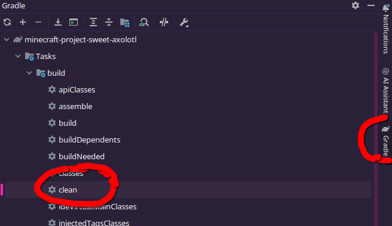
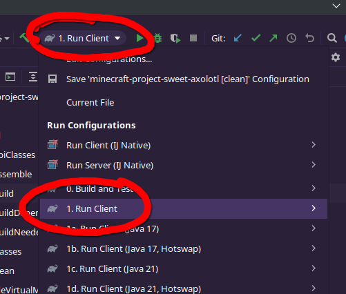
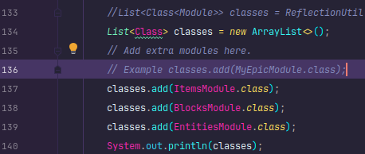

# README
## Setup
1. Clone the repo
2. Open the repo's root folder in Intellij
3. When you open it, it should trigger a Gradle clean build process.  
(depending on certain conditions, you may need to be on a wifi network with minecraftforge.net unblocked)
4. Click on the "Gradle" tab on the right, and under the dropdown Tasks > build, double click on "clean" (img below)  
   
5. Then test if everything works by going the Run dropdown and selecting "1. Run Client" and press the green triangle start button (img below)  
   
6. If you see the client open & load without issues, you're done!!!  
NOTE: You may see errors in the console, if everything you're doing is working fine, then ignore it, it's my stuff.
## Adding other people's code & stuff
1. Under the package ``dev.axolotl.tealsmodloader.tealsmc.mods`` there should be the normal block, items, entities, etc folders.
2. Just add the files in there and register them as needed in the module classes.
3. If you need to register custom modules, enter the ``TEALSModLoader.java`` class under ``dev.axolotl.tealsmodloader.tealsmodloader``,  
and scroll to about line 136 and the module's class to the `List` (img below)  
   
4. If you need to register custom entities & their renderers, look at lines 155 & 177 in ``TEALSModLoader.java`` for examples.
## Exporting it all
1. Run the "build" task under the Gradle tab, if it errors with a ``spotlessJavaCheck``, as long as the compiled file exists everything is fine.
2. The generated file should be under "build/libs/"
3. The jar file you want ends with "-dirty" and only that, for example: ``tealsmodloader-5258345-main+5258345540-dirty.jar``
4. You also need to grab the .jar files from the ``NEEDED_LIBRARIES`` folder as it's a dependency.  
   (I could fix this by compiling it into the final mod jar, but that would take more time to setup)
## Extra things!
### Creative items tabs
If you wanted to, you could set each item's & block's creative tab to ``TestMod.tabTestMod``  
using ``setCreativeTab(TestMod.tabTestMod);`` and then they would all appear under a custom tab in creative mode to make them easier to find.  
 
 
If you need help with anything, just let me know. ^-^
